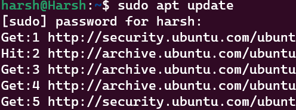

# How to use Hashcat on Windows Device
<div>
Hashcat is one of the fastest password recovery utility, supporting five unique modes of attack for over 300 highly-optimized hashing algorithms.

This repository will help you in downloading and using hashcat on a ubuntu wsl.
First you need to download Ubuntu LTS(preferable) which can found on microsoft store.

After opening the ubuntu shell you can start the below steps.

## Installing hashcat on ubuntu

Update your ubuntu shell if you had it already.

```bash
sudo apt update
```

Press “Y” to confirm the upgrade of all the listed packages, and wait a few minutes to get them downloaded and installed on your computer.


Now install hashcat :

```bash
sudo apt install hashcat
```

If you have an NVIDIA GPU on your computer, you should also install the corresponding package for better performances:
```bash
sudo apt install hashcat-nvidia
```


You can check if you have downloaded correctly by using the following command.

```bash
hashcat --help
```
## Ways to Crack Password Hashes Using hashcat

Hashcat offers a variety of attack modes (Combinator, Rule-based, Brute-force guessing, hybrid, and dictionary attacks) to provide better coverage. Here is an explanation of some attacks that hashcat uses to crack hashed passwords:

Brute-force attack: A brute-force attack utilizes all possible character combinations to determine the exact password. However, it has a limitation of maximum password length and number of characters. Moreover, an advanced level of brute-force attack can also optimize time by making complexity assumptions. For instance, an advanced brute-force technique can assume that the first character is more likely to be upper case and digits are most likely to appear at the end of a password, etc.

Dictionary attack: A dictionary attack utilizes a precomputed list of passwords depending on the information gathered around the target or a pattern observed across users. Hence, it takes some most commonly used passwords and adds some permutations to them to increase the scope.

Hybrid attack: Hybrid is a combination of the above-discussed attacks, as it checks if the password is "crackable" via a dictionary attack and moves on to the brute-force technique, if not possible.

## Basic Syntax of an attack

hashcat attack_mode hash_type hash_wordlist

Example -

```bash
hashcat -a 0 -m 0 hash.txt rockyou.txt
```

Attack modes

1. Wordlist              -a 0
2. Wordlist + Rules      -a 0 
3. Combinator            -a 1  
4. Bruteforce            -a 3

The "-m 0" denotes the hash type of attack.
0 is for MD5,100 is for SHA1....

You can checkout the list by typing "hashcat --help" and it will give you a list for various hash type.

Before moving forward lets first preapre our files and folders required for using hashcat.
I will be doing this in desktop(ps: its easy this way lol :p )

### Making file structure

Make a new folder "hashcat".
Inside it make a folder for "wordlist" , "rules" and "hashes".

You can find all these folders in my github repo.
Just download the files inside and copy them to respective folder.

I have included a file in hashes which contains some already hashed MD5 passwords for us to crack.
You can create even you own by going to the website:- https://www.md5hashgenerator.com

Now lets move towards cracking. Before doing that we need to go to the file structure inside ubuntu shell to start with cracking.

Here is how you do it.

### Accessing your Windows files in the WSL terminal


As you can see in the image,we have access to the c and d drive.
From here on you can move towards your folder.

Command to move to a directory
```bash
cd "file_name"
```

command to find the files inside a directory 
```bash
ls
```

Now that we are inside our directory we can start cracking passwords.


Let's start with wordlist mode.

### Wordlist Mode Attack

Now the question arises of what is a wordlist and how to use them?
Wordlist can be referred to as a password dictionary since it is a collection of passwords stored as plain text.And in order to crack a password or a hash, we need to have a good wordlist which could break the password.

I have included one of the readily used wordlist "rockyou.txt" in the folder wordlist.

Now lets run the command for attack mode wordlist(-a 0) and hashtype MD5(-m 0)

Command:
```bash
hashcat -a 0 -m 0 hashes/pass.txt wordlist/rockyou.txt
```


You will see that we have been able to crack 3/5 hashes with this mode only and that too in few seconds.
One of the passwords is in potfile which can be accessed too.


Now lets see if we can crack more passwords with a "Wordlist + Rules" mode of attack.

### Wordlist + Rules Mode attack

Rules are like a programming language and they help making a large number of combinations with the given wordlist.

You can understand it by following example:-
First of all, consider the following scenario. You have a basic password wordlist containing the words below:

```bash
password
mysecret
qwerty
```
If you wanted to try the above passwords with the pattern “123” added to the end, your list will become:

```bash
password
password123
mysecret
mysecret123
qwerty
qwerty123
```
If you also want to capitalise the first letter of the original words, it will now become:
```bash
password
password123
Password
mysecret
mysecret123
Mysecret
qwerty
qwerty123
Qwerty
```
Although you can type each new pattern manually for each word in your list, this will quickly get impractical with larger wordlists.

Thankfully, we can express these patterns in programming terms using rules. With rules, we can create new passwords through modification of existing passwords supplied.

Instead of having to write every new pattern for each password like above, we only require our original wordlist:

```bash
password
mysecret
qwerty
```
And a file containing the rules that express our patterns:

```bash
$c
$1 $2 $3
```

You do not need to explicitly understand the rules here, you just have to use pre-made rule file with the wordlist to crack the passwords.
I have included one such file "rockyou30000.rule" in the rules folder.

Now lets begin the cracking

Command:
```bash
 hashcat -a 0 -m 0 hashes/pass.txt wordlist/rockyou.txt rules/rockyou30000.rule
````


You will find that no more passwords have been cracked.
To remedy this we can try and change our wordlist acc to what we already know.
I am adding my name "Harsh Raj" and "Hashcat" to the wordlist which i have kept as a password.
(ps: you can make your own wordlist with large number of entries and it will increase the chances of cracking a password)

Now again using the same command we will find that one more hash has been cracked.


You can try editing your wordlist and get better results with each iteration.
A small advice would be adding DOB, username , name to the wordlist if you have the access of the data.


Updating the Wordlist we can find the last password too.


That was it from my side. Hope you learned something if you read it so far, if you want to suggest any changes or correct some mistake i made feel free to ping me.

Thanks!!
</div>